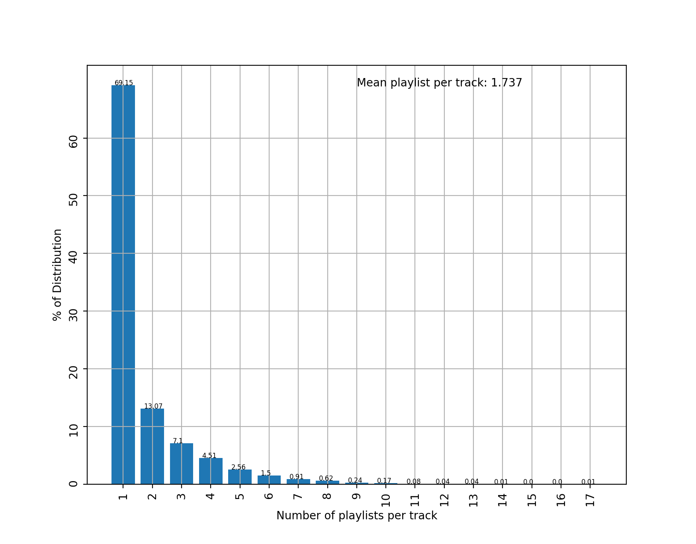
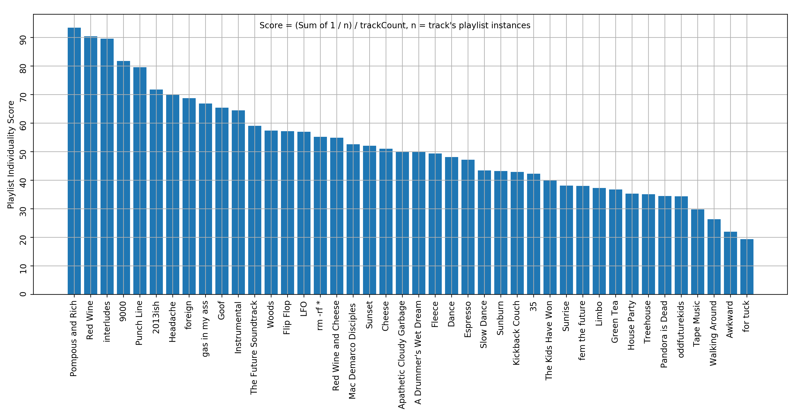

# Spotify Playlist Pollination

Python3. Created to observe cross pollinating tracks across public Spotify playlists, for my own posterity. Shameless plug to my Spotify profile https://open.spotify.com/user/bassguitar1234?si=LTopmXcgTz-j_g2k7HNIYQ

## Installation
Use the package manager pip to install **spotipy**, **matplotlib**, and **numpy**. For spotipy docs go to https://spotipy.readthedocs.io/en/latest/

## Score
Tracks show up on n playlists, with a score of 1 / n. Playlist individuality is sum of track score divided by number of tracks in the playlist. A score of 50 means avg of 2 playlists per track 

